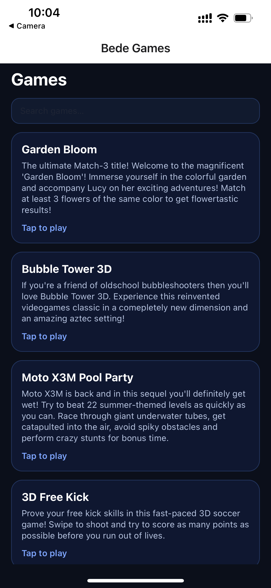
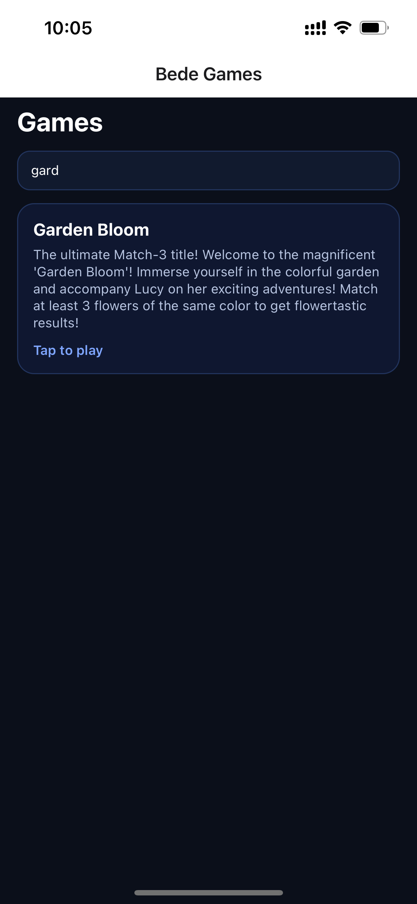
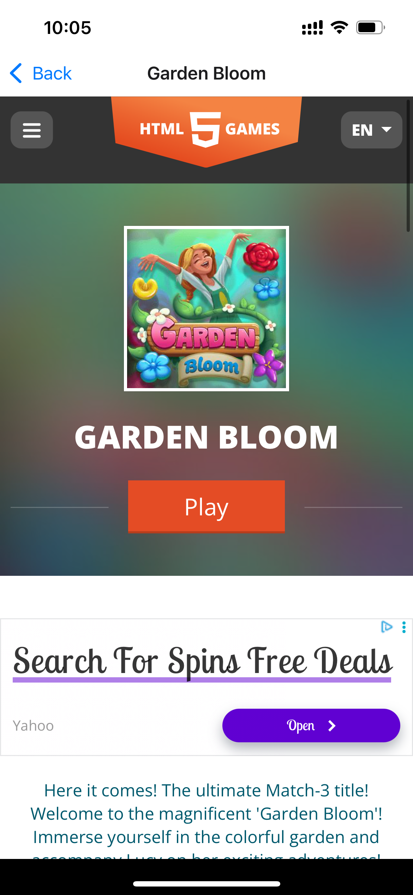
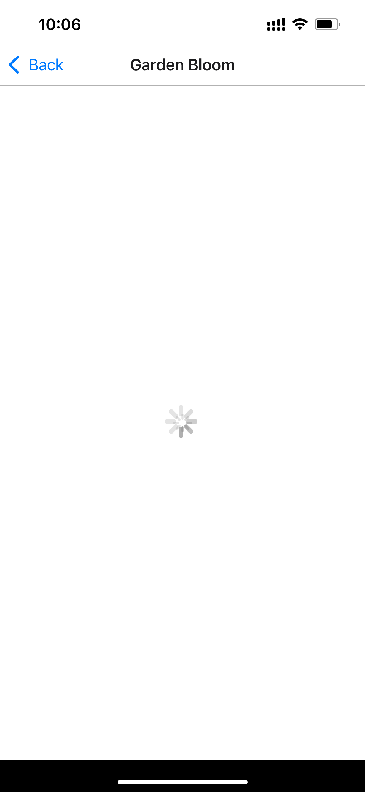

# Bede Games (Expo + TypeScript)

A React Native app that displays a curated list of free HTML5 games and launches the selected game inside a full-screen WebView.

This was built using the **Expo default TypeScript template**, with a focus on clean structure, and a smooth user experience within the time constraints.

---

## Screenshots

### 1) Game List Screen



### 2) Search / Filtering



### 3) Game Player (WebView)



### 4) Loading State



---

## Features

- ✅ Displays a list of a few games (title + short description)
- ✅ Simple search/filtering
- ✅ Launches a **WebView** to play a selected free online game
- ✅ Type-safe navigation params (TypeScript)
- ✅ Loading overlay while the game page loads

---

## Tech Stack

- **Expo** (TypeScript template)
- **React Native**
- **TypeScript**
- **React Navigation (Native Stack)** for screen-to-screen navigation
- **react-native-webview** to embed HTML5 games

---

## Project Structure

```txt
.
├─ App.tsx
├─ src
│  ├─ data
│  │  └─ games.ts
│  ├─ navigation
│  │  └─ types.ts
│  └─ screens
│     ├─ GameListScreen.tsx
│     └─ GamePlayerScreen.tsx
└─ screenshots
   └─
```
